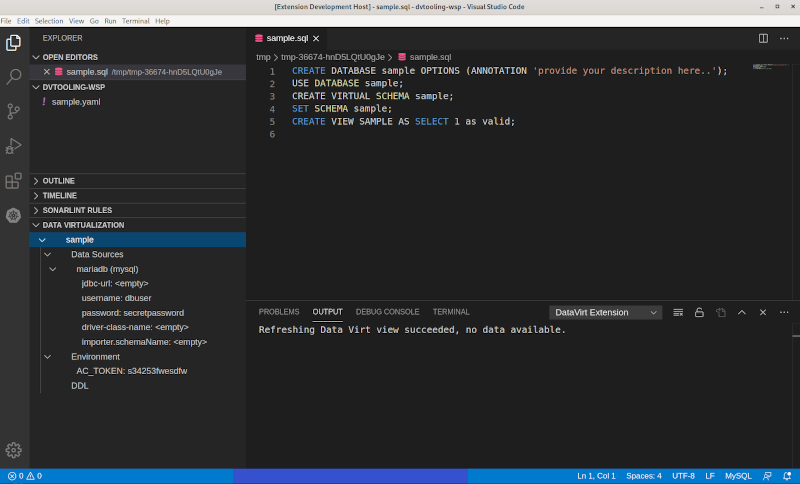

# Red Hat Integration - Data Virtualization Tooling

## Description

This Visual Studio Code extension provides support for Virtual Database development.

## Features

- create and delete virtual databases
- create and delete datasources of predefined types
- create, modify and delete datasource properties
- convert datasources to a secret or configmap
- create, modify and delete environment variables
- convert environment variables to a secret or configmap
- modify the DDL part of the virtual database

## Requirements

  * Java JDK (or JRE) 8 or more recent
  * [Language Support for YAML by Red Hat](https://marketplace.visualstudio.com/items?itemName=redhat.vscode-yaml)
  * [MySQL Syntax](https://marketplace.visualstudio.com/items?itemName=jakebathman.mysql-syntax)

## Contributing

This is an open source project open to anyone. Contributions are extremely welcome!

For information on getting started, refer to the [CONTRIBUTING instructions](CONTRIBUTING.md).

CI builds can be installed manually by following these instructions:

  1) Download the latest development VSIX archive [from here](https://download.jboss.org/jbosstools/vscode/snapshots/vscode-datavirt/?C=M;O=D). `(vscode-datavirt-XXX.vsix)`

  2) Click `View/Command Palette` 
  
  3) Type 'VSIX'

  4) Select 'Install from VSIX...' and choose the `.vsix` file.

## Feedback

File a bug in [Jira](https://issues.redhat.com/projects/FUSETOOLS2/).

## License

Apache License 2.0.
See [LICENSE](LICENSE) file.
