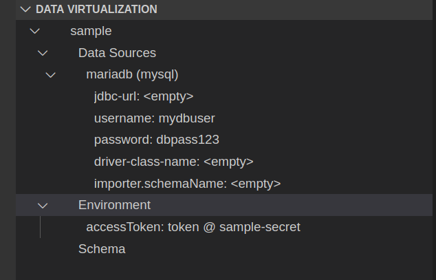
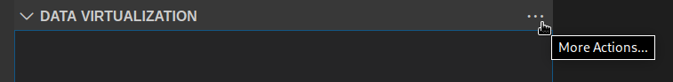
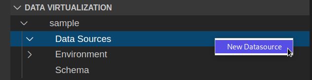
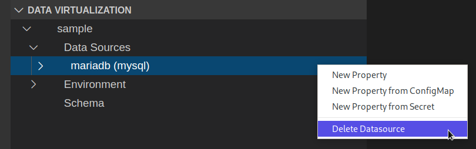
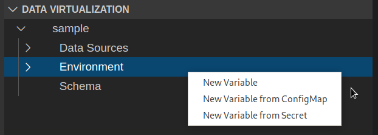
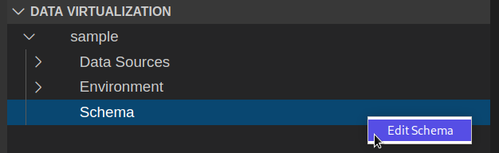
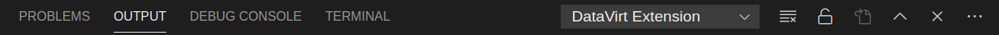

# Red Hat Integration - Data Virtualization Tooling

## Prerequisites

- recent Visual Studio Code

## Features

Red Hat Integration - Data Virtualization Tooling enables you to create a Virtual Database definition file (VDB) and to visualize and manipulate its contents inside [VS Code](https://code.visualstudio.com/).

### The Data Virtualization view
The extension provides its own view to [VS Code](https://code.visualstudio.com/) which is called `Data Virtualization`.

### Creating a Virtual Database definition

There are two ways to create a new VDB file. 

Option 1 would be to open up the command palette (`F1`) of [VS Code](https://code.visualstudio.com/) and to enter `New Virtual Database` into the search field like shown in below screenshot.

Option 2 would be to use the contextual menu inside the `Data Virtualization View` like shown in the below screenshot.

Both options will ask you for a `name` and then provide the new VDB yaml file inside the `Explorer` view. Additionally the `Data Virtualization` view will also display the new VDB as an entry inside that view.

Whenever you want to delete an entry from the `Data Virtualization` view you can simply delete the corresponding `YAML` file in the `Explorer` view.

### Data Sources

Data Sources are used to define database connections.

#### Creating a datasource

To create a new datasource you can invoke the contextual menu of the `Data Sources` node inside the VDB in the `Data Virtualization` view like shown in the below screenshot.

In the following dialogs you will be asked for a `name` and a `type` for this new datasource. Once you finished the dialogs the new datasource will appear directly under the `Data Sources` node.

#### Deleting a datasource

To delete a datasource you invoke the contextual menu on that datasource and select the `Delete` menu entry.

#### Manipulating datasource properties

A datasource contains a set of predefined properties which can be specified for this type of datasource. Additionally you can also create custom properties by using one of the 3 available `New Property` contextual menu items on a datasource.

`New Property` - This will create a new key / value pair stored directly inside the YAML file.

`New Property from ConfigMap` - This will create a reference to an entry inside a ConfigMap.

`New Property from Secret` - This will create a reference to an entry inside a Secret.

When using a ConfigMap or Secret you will be asked for a `reference name` which is the name of the ConfigMap or Secret and the `reference key` which is the key under which the value is stored in the ConfigMap / Secret.
The `value` is not mandatory if you are using a reference.

If you want to delete a property you can invoke the contextual menu on the specific property you want to delete and simply select `Delete Property`. The same procedure applies when you want to edit a property just that you select `Edit Property` instead.

### Environment Variables

An environment variable can contain required information for the Data Virtialization. There are no predefined variables added when creating a new VDB. If you want to create an environment variable you can do that by invoking the contextual menu on the `Environment` entry inside the `Data Virtualization` view as shown in the screenshot below.

Similar to the datasource properties you can choose one of the 3 available options of `New Variable` contextual menu items.

`New Variable` - This will create a new key / value pair stored directly inside the YAML file.

`New Variable from ConfigMap` - This will create a reference to an entry inside a ConfigMap.

`New Variable from Secret` - This will create a reference to an entry inside a Secret.

When using a ConfigMap or Secret you will be asked for a `reference name` which is the name of the ConfigMap or Secret and the `reference key` which is the key under which the value is stored in the ConfigMap / Secret.
The `value` is not mandatory if you are using a reference.

If you want to delete a variable you can invoke the contextual menu on the specific variable you want to delete and simply select `Delete Variable`. The same procedure applies when you want to edit a variable just that you select `Edit Variable` instead.

### Modifying the Schema

When creating a new VDB file you are supplied with a schema template which creates a simple view to be used in the data virtualization runtime. If you want to make modifications to that schema you can use the `Edit Schema` contextual menu on the `Schema` node of your VDB inside the `Data Virtualization` view.

This option will open the schema (the DDL section of the YAML) in an editor for you. 

(__WORK IN PROGRESS__) In future that editor will provide code completion, syntax coloring and more intellisense to help you create the schema faster. 

### The extension log output channel

The Data Virtualization extension provides its own logging output channel to help users understanding problems that might occur during usage. This log might be useful for reporting issues back. (see the screenshot below)

## How to contribute

Contributions to the project are welcome. You can either report issues, ask for new features, provide pull requests for code or documentation files.

See [Contributing guide](./Contributing.md)
